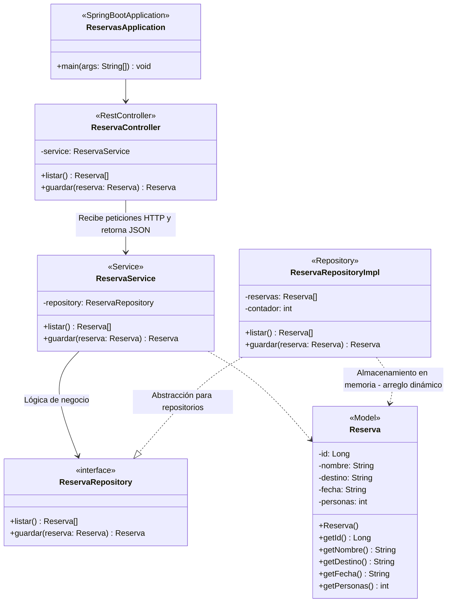

# Diagrama de Clases — Sistema de Reservas (Spring Boot)

## Diagrama de clases (Mermaid)

---

## Clases

### `ReservasApplication`
> «SpringBootApplication»

| Modificador | Método | Retorno |
|-------------|--------|---------|
| `+` | `main(args: String[])` | `void` |

---

### `ReservaController`
> «RestController»

**Atributos**

| Modificador | Nombre | Tipo |
|-------------|--------|------|
| `-` | `service` | `ReservaService` |

**Métodos**

| Modificador | Método | Retorno | Endpoint |
|-------------|--------|---------|----------|
| `+` | `listar()` | `Reserva[]` | `GET /reservas` |
| `+` | `guardar(reserva: Reserva)` | `Reserva` | `POST /reservas` |

---

### `ReservaService`
> «Service»

**Atributos**

| Modificador | Nombre | Tipo |
|-------------|--------|------|
| `-` | `repository` | `ReservaRepository` |

**Métodos**

| Modificador | Método | Retorno |
|-------------|--------|---------|
| `+` | `listar()` | `Reserva[]` |
| `+` | `guardar(reserva: Reserva)` | `Reserva` |

---

### `ReservaRepository`
> «interface»

**Métodos**

| Modificador | Método | Retorno |
|-------------|--------|---------|
| `+` | `listar()` | `Reserva[]` |
| `+` | `guardar(reserva: Reserva)` | `Reserva` |

---

### `ReservaRepositoryImpl`
> «Repository» — implementa `ReservaRepository`

**Atributos**

| Modificador | Nombre | Tipo |
|-------------|--------|------|
| `-` | `reservas` | `Reserva[]` |
| `-` | `contador` | `int` |

**Métodos**

| Modificador | Método | Retorno |
|-------------|--------|---------|
| `+` | `listar()` | `Reserva[]` |
| `+` | `guardar(reserva: Reserva)` | `Reserva` |

> **Nota:** Almacenamiento en memoria con arreglo dinámico.
> - Si se llena → duplica el tamaño del arreglo
> - Asigna ID automáticamente

---

### `Reserva`
> «Model»

**Atributos**

| Modificador | Nombre | Tipo |
|-------------|--------|------|
| `-` | `id` | `Long` |
| `-` | `nombre` | `String` |
| `-` | `destino` | `String` |
| `-` | `fecha` | `String` |
| `-` | `personas` | `int` |

**Métodos**

| Modificador | Método | Retorno |
|-------------|--------|---------|
| `+` | `Reserva()` | — (constructor) |
| `+` | `getId()` | `Long` |
| `+` | `getNombre()` | `String` |
| `+` | `getDestino()` | `String` |
| `+` | `getFecha()` | `String` |
| `+` | `getPersonas()` | `int` |

---

## Relaciones

| Desde | Tipo | Hacia | Descripción |
|-------|------|-------|-------------|
| `ReservasApplication` | Composición | `ReservaController` | Punto de entrada de la app |
| `ReservaController` | Asociación | `ReservaService` | Delega la lógica |
| `ReservaService` | Asociación | `ReservaRepository` | Lógica de negocio |
| `ReservaRepositoryImpl` | Implementación | `ReservaRepository` | Realización de la interfaz |
| `ReservaService` | Dependencia | `Reserva` | Opera con el modelo |
| `ReservaRepositoryImpl` | Dependencia | `Reserva` | Almacena instancias del modelo |
